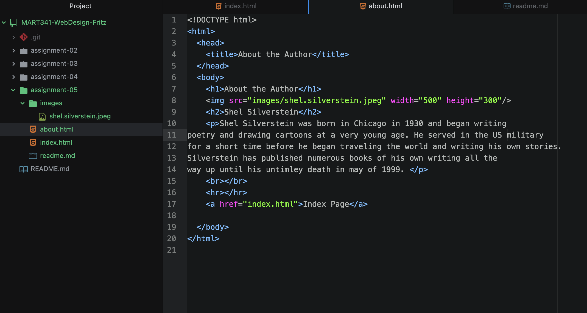

# Assignment 5
Using The WayBack Machine, I decided to visit UM's college radio station
KBGA.org way back in 2005 and then even farther back into 2000.
I used to be a DJ for KBGA about a year ago at this
point, so I was curious how the website had changed over the years.
I was surprised to see it was fairly modern for the time, but it has come such
a long way. The KBGA staff do a great job of keeping the website looking fresh.
The websites of old looked clunky but had a quirkiness to them that made you
think it was done by someone on a single computer.

I am still grasping the handle on these few topics, but I think it is all slowly
coming together for me. My biggest distress is always directory structure and
keeping everything on a consistent "level" and I feel I have done fairly well
at that so far, but I would like to get to the point where I am comfortable
doing it myself without having to use a guide.

